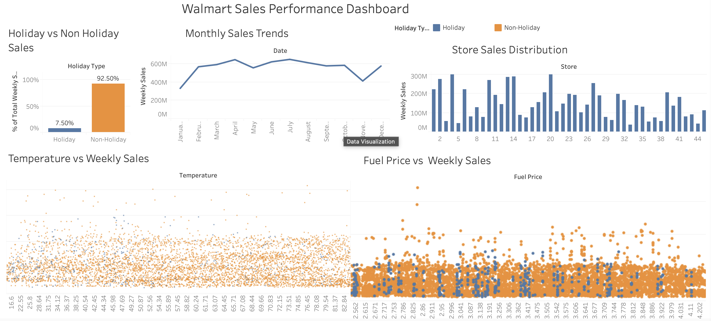

# Walmart Sales Tableau Dashboard
This project analyzes Walmart weekly sales data using Tableau.
## Dashboard Preview

## Key Insights
- Non-holiday weeks contribute around 92% of total sales.
- Sales remain relatively stable throughout the year.
- Store performance varies significantly across locations.
- Temperature and fuel price show minimal correlation with weekly sales.
## Tools Used
- Tableau Public
- Data Visualization
- Business Analytics
## Files in this Repository
- Walmart_Sales_Dashboard.twbx – Tableau workbook
- Dashboard.png – Dashboard preview image

